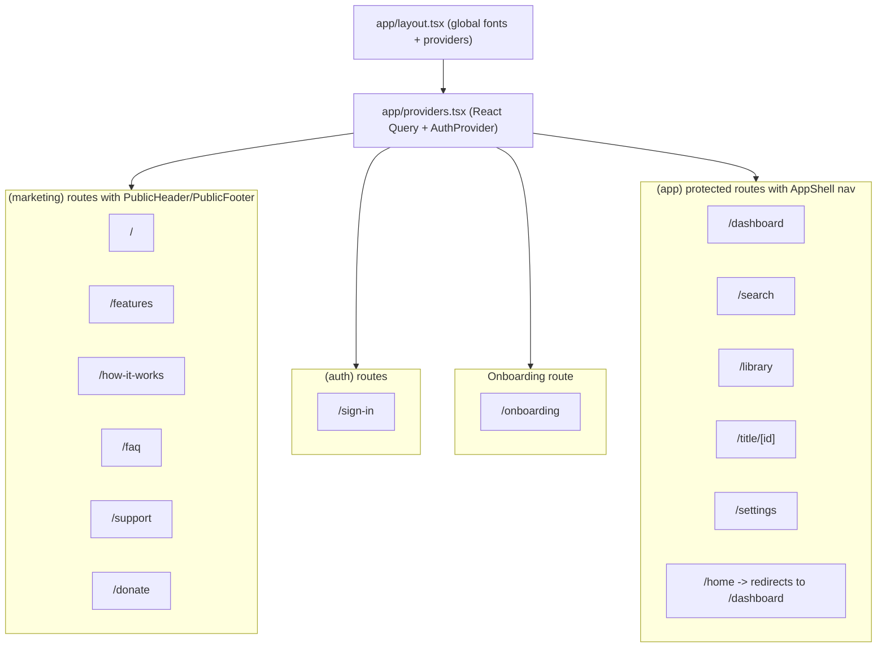
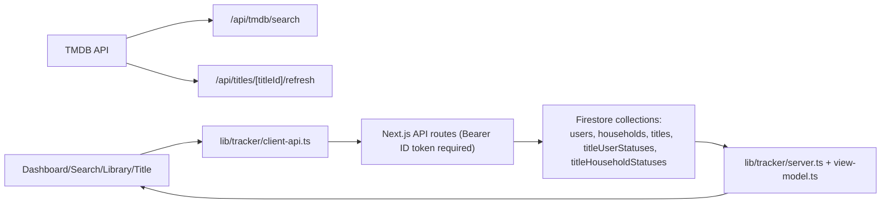

# FilmPickle App Map and Architecture Handoff

Last updated: April 10, 2026  
Repo: `movieandshowtracker`

This document is meant as a high-context handoff for a new ChatGPT session. It covers:

- What the app is and how it works
- Every marketing/auth/internal page and what appears on each
- How data is split between user-level and household-level state
- How API routes and UI actions connect
- Current product boundaries and known limitations

---

## 1) Product Summary

FilmPickle is a household-aware movie/TV tracker built with Next.js App Router, Firebase Auth, Firestore, and TMDB.

Core product loop:

1. Sign in.
2. Create or join a household (solo households are supported).
3. Search TMDB and add titles.
4. Track personal status (per member): wants/watched/rating/notes.
5. Track shared household status: shared watchlist + watched together event.
6. Browse dashboard/library/title detail views to decide what to watch next.

Design intent:

- Works for one person, two people, and 3+ member households.
- Keeps personal and shared signals separate to avoid “one big blob” tracking.

---

## 2) Route and Layout Diagram

---

## 3) Page Inventory

## Marketing Pages

All marketing pages use `app/(marketing)/layout.tsx` with:

- `PublicHeader` nav links: Home, Features, How it works, FAQ, Support
- `PublicAuthCta` actions: sign-in / create account, or “Open app” when already signed in
- `PublicFooter` links: Home, Features, How it works, FAQ, Support, Sign in, Donate

| Route | Purpose | Main content on page |
|---|---|---|
| `/` | Landing/home | Hero pitch, CTA row, “why it lands”, capture/align/decide sections, watch mode cards (solo/two/household), product-preview style panels. |
| `/features` | Feature marketing | “Available now” list, “Planned next” list, feature blocks (capture/browse/track/share/adapt/decide), watch-mode cards. |
| `/how-it-works` | Flow explanation | Personal steps, shared steps, callouts about solo-first and invite-later usage, screenshot placeholders, CTA. |
| `/faq` | Expectations + limitations | Q&A for solo use, households, pricing, TV episode progress limitations, household/account management limitations, mobile web support. |
| `/support` | Contact/help | Email support card + blocks for feedback, bug reports, and questions. |
| `/donate` | Funding page | Ko-fi external link (`ko-fi.com/cleantoolsfornow`) and reasons support helps (hosting/polish/maintenance). |

## Auth + Onboarding Pages

| Route | Purpose | Main behavior/content |
|---|---|---|
| `/sign-in` | Auth entry | Google sign-in plus email/password sign-in and sign-up modes. `?mode=sign-up` toggles create-account mode. Redirects signed-in users to `/dashboard` if household exists, else `/onboarding`. |
| `/onboarding` | Household setup | Two forms: create household (gets invite code) or join household (invite code). Supports staying briefly on a “created household” onboarding state via session storage and `?created=1`. |

## Protected App Pages

Protected pages are wrapped by `app/(app)/layout.tsx`:

- `HouseholdGuard` enforces auth + household membership
- `HouseholdProvider` loads household summary/members
- `AppShell` top nav: Dashboard, Search, Library, Profile(Settings)

| Route | Purpose | Main behavior/content |
|---|---|---|
| `/dashboard` | Home overview | Household-mode-aware hero and summary cards, quick actions (Search/Library), sections like Want to watch / Recently watched / Recently added, plus shared-watch callout when relevant. |
| `/search` | Add titles | Debounced TMDB search (auth required), quick suggestions, recent searches (localStorage), result cards with personal actions and optional shared actions. |
| `/library` | Browse/filter titles | Filters by media, view/state, member-focused filters, sort options, shared-watch callout, poster grid, status-aware empty states. |
| `/title/[id]` | Title detail + editing | Backdrop/poster metadata view, TMDB refresh button, household summary chips, shared watch participant callout, full `TitleStatusEditor`. |
| `/settings` | Account + household settings | Avatar upload/compression, display name update, sign-out, invite code copy/share, household members list. |
| `/home` | Legacy route | Immediately redirects to `/dashboard`. |

---

## 4) Ownership Model (User vs Household)

This is the most important conceptual split in the app.

| Scope | Stored in | Examples |
|---|---|---|
| Auth identity | Firebase Auth | `uid`, `email`, `displayName`, `photoURL` |
| App user profile | `users/{uid}` | `avatarDataUrl`, `householdId`, profile copy fields |
| Shared household | `households/{householdId}` | `name`, `inviteCode`, `memberIds[]` |
| Shared title metadata | `titles/{titleId}` | TMDB IDs + canonical title metadata |
| Per-user title state | `titleUserStatuses/{householdId_titleId_userId}` | `wantsToWatch`, `watched`, `rating`, `notes` |
| Per-household title state | `titleHouseholdStatuses/{titleId}` | `householdWantsToWatch`, `watchedTogether`, participant IDs |

Practical meaning:

- “I watched this” is personal.
- “We watched together” is a shared household event.
- “Shared watchlist” is household-level.
- Ratings/notes are personal only.

---

## 5) Data and ViewModel Flow

Key idea:

- Firestore stores base records.
- Server builds a `TitleViewModel` by joining title + member + status docs.
- UI renders from the view model instead of directly composing raw docs client-side.

---

## 6) Internal Behavior by Household Size

## Solo household (1 member)

- Shared constructs are mostly hidden/minimized.
- Personal wants/watched/rating/notes are primary.
- Dashboard summaries focus on personal counts.

## Two-member household

- Emphasizes overlap:
- “Both want to watch”
- “Both watched”
- “Watched together”
- Search and title editor can set shared statuses and both-member watch tracking.

## 3+ member household

- Adds participant-aware “watched together” flow.
- Supports subgroup shared-watch events without forcing every member to “watched”.
- Library/dashboard include “partially watched” and “multiple members want” style slices.

---

## 7) Core API Surface

All API routes require Firebase ID token via `Authorization: Bearer <token>`.

## Household APIs

| Endpoint | Method | Purpose |
|---|---|---|
| `/api/households/create` | `POST` | Creates household + invite code, assigns creator membership. |
| `/api/households/join` | `POST` | Joins by invite code; prevents switching to another household if already in one. |
| `/api/households/me` | `GET` | Returns household summary + member profiles. |

## Title/TMDB APIs

| Endpoint | Method | Purpose |
|---|---|---|
| `/api/tmdb/search` | `GET` | Auth-gated TMDB multi search, normalized results. |
| `/api/titles/add` | `POST` | Adds/updates title and applies one add-action (personal/shared). |
| `/api/titles/list` | `GET` | Returns household title view models with optional filters/sort. |
| `/api/titles/[titleId]` | `GET` | Returns one title view model. |
| `/api/titles/[titleId]` | `PATCH` | Mutates personal/shared status fields based on action union. |
| `/api/titles/[titleId]/refresh` | `POST` | Refreshes metadata from TMDB detail endpoint. |

---

## 8) Title Status Actions

## Add actions (`/api/titles/add`)

- `mark_user_wants_to_watch`
- `mark_user_watched`
- `mark_household_wants_to_watch`
- `mark_watched_together`

## Patch actions (`/api/titles/[titleId]`)

- `set_user_wants_to_watch`
- `set_user_watched`
- `set_household_wants_to_watch`
- `set_watched_together`
- `set_user_rating`
- `set_user_notes`

Behavior constraints:

- Cross-member personal status edits require same-household membership checks.
- Rating/notes are restricted to the acting user’s own status row.
- Watched-together participant lists must contain at least 2 in-household members when provided.

---

## 9) Auth, Guarding, and Redirect Logic

- `AuthProvider` subscribes to Firebase auth state and user profile snapshots.
- `HouseholdGuard` behavior:
- If not signed in: redirect to `/sign-in?next=<current route>`.
- If signed in but no household: redirect to `/onboarding`.
- `/sign-in` behavior:
- Signed-in users are redirected to:
- `/dashboard` if `profile.householdId` exists
- `/onboarding` otherwise
- `next` query parameter is sanitized by `getPostSignInPath()` to avoid unsafe redirects.

---

## 10) What Is On Each Key Internal UI Surface

## Dashboard

- Household-aware welcome and mode chips
- Summary metrics that differ by household size
- Optional shared-watch callout
- Title sections rendered as poster grids

## Search

- Search input with 350ms debounce
- Quick suggestion chips
- Recent searches persisted in localStorage
- Result cards with:
- Personal actions: Want to watch, Watched
- Shared actions (when not solo): shared watchlist, watched together
- Participant picker for 3+ watched-together actions

## Library

- Filter groups: media, view, member focus, sort
- Dynamic chips reflecting active filter state
- Empty-state messaging tuned to context/filter
- Poster cards showing personal + shared household signals

## Title detail

- Backdrop/poster and rich metadata
- Refresh metadata from TMDB
- Personal summary or household summary depending on member count
- Shared-watch callout and participant display
- `TitleStatusEditor` for all relevant status writes

## Settings

- Signed-in identity display
- Avatar upload and compression flow
- Display name update
- Household invite code copy/share
- Member list with identity/avatars

---

## 11) Current Boundaries and Planned Gaps

Explicitly reflected in marketing copy and FAQ:

- Free product currently.
- TV tracked at title level only; deeper episode/season progress planned.
- Household leave flow not implemented yet.
- Account deletion not implemented yet.
- Import/export not implemented yet.
- Better household management and stronger watch-night decision tooling are planned next layers.

---

## 12) Quick Mental Model for Future Work

If extending this app, keep these invariants:

- Preserve personal vs household state separation.
- Keep household membership checks on all cross-user/shared writes.
- Continue building UI off `TitleViewModel` to avoid fragmented client logic.
- Treat “watched together” as a household event that may not imply every member watched.
- Maintain solo-first usability even when adding richer household features.

---

## 13) Stack, Versions, and Runtime Context

- Next.js `16.2.2` (App Router).
- React `19.2.4`.
- TypeScript strict mode enabled.
- Firebase client SDK `12.x` + Firebase Admin SDK `13.x`.
- React Query (`@tanstack/react-query`) for client-side data fetching/caching.
- Zod for API payload validation.
- Vitest + Testing Library + JSDOM for tests.
- Tailwind CSS v4 + custom app/marketing visual styles.

Important runtime detail:

- API routes are auth-gated and expect Firebase ID tokens in `Authorization` headers.
- Firestore business writes are server-side (Admin SDK) for household/title collections.

---

## 14) Environment and Configuration Requirements

Required env vars (from `.env.local.example`):

- `NEXT_PUBLIC_FIREBASE_API_KEY`
- `NEXT_PUBLIC_FIREBASE_AUTH_DOMAIN`
- `NEXT_PUBLIC_FIREBASE_PROJECT_ID`
- `NEXT_PUBLIC_FIREBASE_STORAGE_BUCKET`
- `NEXT_PUBLIC_FIREBASE_MESSAGING_SENDER_ID`
- `NEXT_PUBLIC_FIREBASE_APP_ID`
- `TMDB_API_KEY`
- `TMDB_BASE_URL` (defaults to `https://api.themoviedb.org/3`)
- `FIREBASE_ADMIN_PROJECT_ID`
- `FIREBASE_ADMIN_CLIENT_EMAIL`
- `FIREBASE_ADMIN_PRIVATE_KEY`

Notes:

- `FIREBASE_ADMIN_PRIVATE_KEY` is expected with escaped newlines and is normalized in code (`\\n` -> actual newline).
- Missing Firebase client config prevents normal auth flow; `proxy.ts` includes a fallback redirect for `/home`.

---

## 15) Repo Structure and Source-of-Truth Orientation

High-level layout:

- `app/`: route handlers + page routes
- `components/`: UI pieces by domain (auth, marketing, home, library, status, household, common)
- `lib/`: domain logic (auth, firebase, tracker, households, firestore helpers)
- `app/api/`: server API routes
- `tests/`: vitest suites
- `scripts/`: migration/maintenance scripts
- `docs/`: planning + architecture docs

Read-order recommendation for new contributors/models:

1. `docs/app-page-map-and-architecture-handoff.md` (this file)
2. `docs/current-data-model-diagram.md`
3. `components/home/dashboard-page.tsx`, `app/(app)/library/page.tsx`, `components/status/title-status-editor.tsx`
4. `lib/tracker/server.ts`, `lib/tracker/view-model.ts`, `lib/tracker/shared.ts`
5. `app/api/titles/*.ts` and `app/api/households/*.ts`

Docs caveat:

- `docs/old-outdated/` contains historical planning docs and should not be treated as current source of truth.

---

## 16) Security Model and Access Boundaries

Client permissions:

- Client can read/update only own `users/{uid}` profile fields under strict rules.
- Client cannot directly read/write `households`, `titles`, `titleUserStatuses`, `titleHouseholdStatuses`.

Server responsibilities:

- Verifies Firebase ID token per request.
- Resolves acting user household.
- Enforces household membership checks for user-targeted or shared writes.
- Validates payloads (especially add/patch title routes) with Zod.

Operational implication:

- Business logic and authorization checks belong in API routes/server libs, not in client components.

---

## 17) Testing and Quality Coverage Snapshot

Current tests cover major slices, including:

- Auth/sign-in/guard behavior.
- Household context and household client/server API interactions.
- Title APIs and server view-model logic.
- Shared helpers and TMDB normalization.
- Core UI screens/components for dashboard/library/title/settings/search behavior.
- Marketing/header CTA behavior.

Representative suites:

- `tests/tracker-title-routes.test.ts`
- `tests/tracker-server.test.ts`
- `tests/tracker-view-model.test.ts`
- `tests/title-status-editor.test.tsx`
- `tests/library-page.test.ts`
- `tests/home-page-household-modes.test.tsx`
- `tests/settings-page-household-modes.test.tsx`

---

## 18) Historical Migration Context

The repo includes legacy-status migration tooling, indicating a model evolution from older `titleStatuses` docs to split status collections:

- `scripts/backfill-title-statuses.mjs`
- `scripts/normalize-title-user-statuses.mjs`
- `scripts/delete-legacy-title-statuses.mjs`

What this means for future work:

- Be mindful of legacy data assumptions when editing status logic.
- Keep compatibility with existing migrated datasets unless explicitly performing a new migration.
- Prefer additive migrations with `--dry-run` support (pattern already present in scripts).
