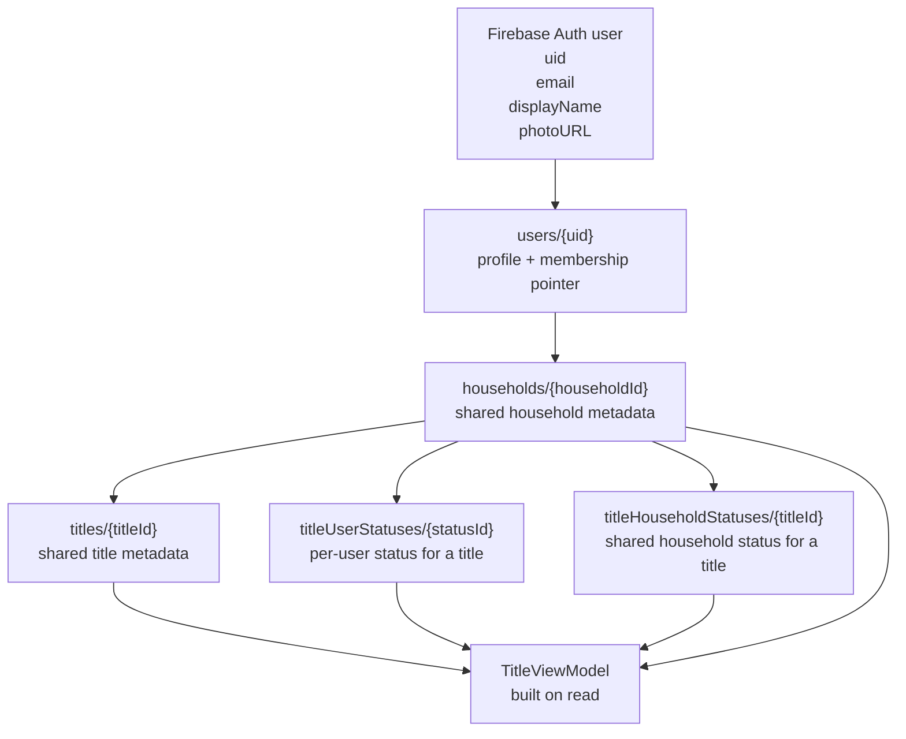
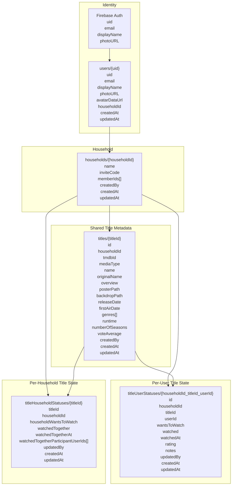
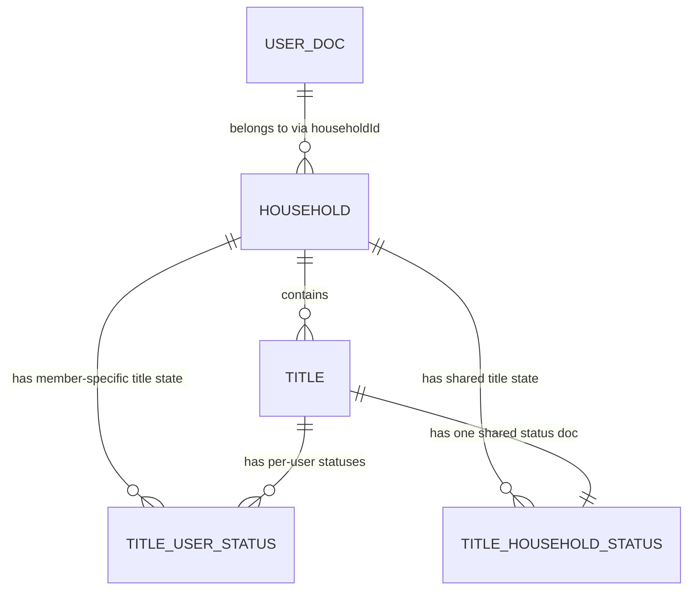

# Current Data Model Diagram

This is the current data shape in the app today, based on the code in this repo.

It shows:

- what lives in Firebase Auth
- what lives in Firestore
- what is per-user
- what is per-household
- what is derived at read time and not stored directly

## High-level map

## Entity breakdown

## What lives where

### Firebase Auth

This is the authentication identity layer.

Fields used by the app:

- `uid`
- `email`
- `displayName`
- `photoURL`

Notes:

- Auth is the source for sign-in/session.
- Some of these fields are copied into `users/{uid}` for app use.
- The app does not use Auth alone as the full profile source.

### `users/{uid}`

This is the app-level user profile document.

Stores:

- identity/profile fields used by the app UI
- custom avatar data
- the pointer to the user’s current household

Current fields:

- `uid`
- `email`
- `displayName`
- `photoURL`
- `avatarDataUrl`
- `householdId`
- `createdAt`
- `updatedAt`

Important meaning:

- This is where membership is attached from the user side.
- A user currently belongs to at most one household.

### `households/{householdId}`

This is the shared household record.

Current fields:

- `name`
- `inviteCode`
- `memberIds[]`
- `createdBy`
- `createdAt`
- `updatedAt`

Important meaning:

- `memberIds[]` is the actual household membership list.
- `inviteCode` is how other users join.
- There are no owner/admin/member roles yet in the current model.

### `titles/{titleId}`

This is shared metadata about a title inside one household.

Current fields:

- `id`
- `householdId`
- `tmdbId`
- `mediaType`
- `name`
- `originalName`
- `overview`
- `posterPath`
- `backdropPath`
- `releaseDate`
- `firstAirDate`
- `genres[]`
- `runtime`
- `numberOfSeasons`
- `voteAverage`
- `createdBy`
- `createdAt`
- `updatedAt`

Important meaning:

- This is not per-user.
- A title is household-scoped.
- `titleId` is deterministic today:
  - `{householdId}_{mediaType}_{tmdbId}`

### `titleUserStatuses/{statusId}`

This is the per-user status record for one title.

Current fields:

- `id`
- `householdId`
- `titleId`
- `userId`
- `wantsToWatch`
- `watched`
- `watchedAt`
- `rating`
- `notes`
- `createdAt`
- `updatedAt`
- `updatedBy`

Important meaning:

- This is where individual user state lives.
- One household title can have one user-status doc per member.
- This is the current place for:
  - personal watchlist state
  - personal watched state
  - personal rating
  - personal notes

### `titleHouseholdStatuses/{titleId}`

This is the per-household shared status record for one title.

Current fields:

- `titleId`
- `householdId`
- `householdWantsToWatch`
- `watchedTogether`
- `watchedTogetherAt`
- `watchedTogetherParticipantUserIds[]`
- `createdAt`
- `updatedAt`
- `updatedBy`

Important meaning:

- This is shared state, not tied to one member.
- This is currently where the app stores:
  - shared watchlist state
  - watched-together event state
  - optional watched-together participant list

## What is derived, not stored directly

The app builds a `TitleViewModel` on read by combining:

- title metadata from `titles`
- household members from `households` + `users`
- per-user records from `titleUserStatuses`
- shared record from `titleHouseholdStatuses`

These fields are computed, not persisted directly:

- `watchedCount`
- `wantsToWatchCount`
- `memberCount`
- `anyMembersWatched`
- `allMembersWatched`
- `someMembersWatched`
- `noMembersWatched`
- `anyMembersWantToWatch`
- `allMembersWantToWatch`
- `someButNotAllMembersWantToWatch`
- `noMembersWantToWatch`
- `multipleMembersWantToWatch`
- `currentUser`
- member display labels such as `You`
- watched-together participant count / known-state helpers

In other words:

- Firestore stores the source-of-truth pieces
- the server builds the household-aware read model

## Relationship summary

Plain-English version:

- one user points to one household
- one household has many members
- one household has many titles
- one title can have many per-user status docs
- one title can have one shared household status doc

## Browser-only state

A few things are not stored in Firestore at all.

### `localStorage`

- recent searches on the search page

Key currently used:

- `tracker_recent_searches_v1`

### `sessionStorage`

- recently created invite code during onboarding flow

Key currently used:

- `tracker_created_household_invite_code`

## Practical interpretation

If you want to know where a piece of information should live today:

- "Who is this person?" -> Firebase Auth + `users/{uid}`
- "Which household are they in?" -> `users/{uid}.householdId` and `households/{householdId}.memberIds`
- "What is this movie/show?" -> `titles/{titleId}`
- "Did Alex watch it?" -> `titleUserStatuses`
- "Did the household save it together?" -> `titleHouseholdStatuses`
- "How many members watched it?" -> derived in the view model, not stored directly

## Biggest current modeling constraint

The current model is strong for:

- title metadata
- personal title state
- shared household title state

The biggest thing it does not model yet is progress within a show:

- season progress
- episode progress
- continue watching state
- multiple watch events / rewatches

That is the main next layer if the app needs to evolve beyond title-level tracking.
